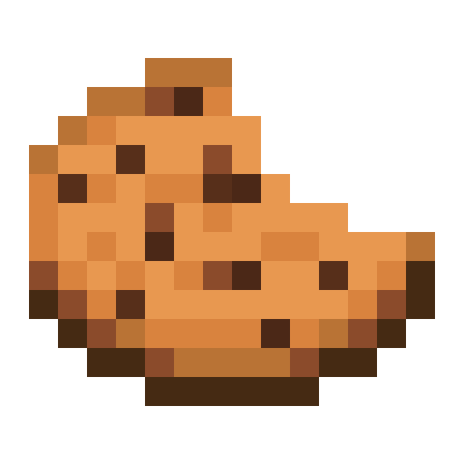

# brOkie (browser cookie)

## Inspiration

While drowning in school assignments, we realized browser cookies were quietly lurking behind the scenes, shaping our online experiences. Instead of fearing them, we decided to visualize them—and maybe have a little fun along the way. Thus, brOkie was born: a browser cookie visualization extension designed for those who appreciate creative nonsense in the name of technology.

## What it does

brOkie turns browser cookies into interactive physics-based cookies. Each cookie on a website appears as a floating "cookie" sprite, sized according to its metadata.  
Here’s what happens when a user clicks a cookie:

- A modal displays cookie metadata, quirky facts, and five random key-value pairs, powered by the Gemini 1.5 Flash model.
- The cookie sprite gets visibly "bitten" and drops crumbs.

## Inspiration

While drowning in school assignments, we realized browser cookies were quietly lurking behind the scenes, shaping our online experiences. Instead of fearing them, we decided to visualize them—and maybe have a little fun along the way. Thus, brOkie was born: a browser cookie visualization extension designed for those who appreciate creative nonsense in the name of technology.

## What it does

brOkie turns browser cookies into interactive physics-based cookies. Each cookie on a website appears as a floating "cookie" sprite, sized according to its metadata.  
Here’s what happens when a user clicks a cookie:

- A modal displays cookie metadata, quirky facts, and five random key-value pairs, powered by the Gemini 1.5 Flash model.
- The cookie sprite gets visibly "bitten" and drops crumbs.
- After three bites—because three is the magic cookie number—the cookie explodes into a delightful cascade of crumbs.

brOkie makes invisible data visible, turning web cookies into something you can see, click, and metaphorically eat.

## How we built it

We built brOkie using:

- JavaScript for the extension logic.
- Matter.js to give cookies 2D physics.
- Gemini 1.5 Flash Model for generating metadata descriptions and "bite-sized" (haha) facts.

We built brOkie using:

- **JavaScript** for the extension logic.
- **Matter.js** to give cookies 2D physics.
- **Gemini 1.5 Flash Model** for generating metadata descriptions and "bite-sized" (haha) facts.

It’s a mix of engineering precision and crumb-filled chaos.

## Challenges we ran into

1. Learning Browser Extension Development: Extensions are a different cookie compared to standard web development. We spent hours figuring out how to work within its constraints.
2. Physics Gone Wild: Our initial implementation of physics was so bad it would crash your browser. Matter.js saved the day after much trial and error.
3. Cookie Biting: Designing the biting animation and syncing it with interactive logic at 3 a.m. was no easy feat, but caffeine helped.

## Accomplishments that we're proud of

- Our First Browser Extension: It works, it's fun, and it doesn’t break (often).
- Responsive Physics: Realistic physics without frying browsers.
- Perfect Timing: Completing the project while juggling assignments—true multitasking mastery.

## What we learned

We learned browser extension development from scratch, how to integrate a 2D physics engine with Matter.js, and how AI models can generate engaging content. Most importantly, we learned that sometimes, even the most absurd ideas are worth pursuing.

## What's next for brOkie

1. Cross-Browser Compatibility: Firefox deserves cookies too.
2. Seasonal Themes: Adding a milk-and-cookies Christmas update (because milk improves everything).
3. More Interaction: More ways to crumble, explode, and visualize cookie data.
4. **Learning Browser Extension Development**: Extensions are a different cookie compared to standard web development. We spent hours figuring out how to work within its constraints.
5. **Physics Gone Wild**: Our initial implementation of physics was so bad it would crash your browser. Matter.js saved the day after much trial and error.
6. **Cookie Biting**: Designing the biting animation and syncing it with interactive logic at 3 a.m. was no easy feat, but caffeine helped.

## Accomplishments that we're proud of

- **Our First Browser Extension**: It works, it's fun, and it doesn’t break (often).
- **Responsive Physics**: Realistic physics without frying browsers.
- **Perfect Timing**: Completing the project while juggling assignments—true multitasking mastery.

## What we learned

We learned browser extension development from scratch, how to integrate a 2D physics engine with Matter.js, and how AI models can generate engaging content. Most importantly, we learned that sometimes, even the most absurd ideas are worth pursuing.

## What's next for brOkie

1. **Cross-Browser Compatibility**: Firefox deserves cookies too.
2. **Seasonal Themes**: Adding a milk-and-cookies Christmas update (because milk improves everything).
3. **More Interaction**: More ways to crumble, explode, and visualize cookie data.
